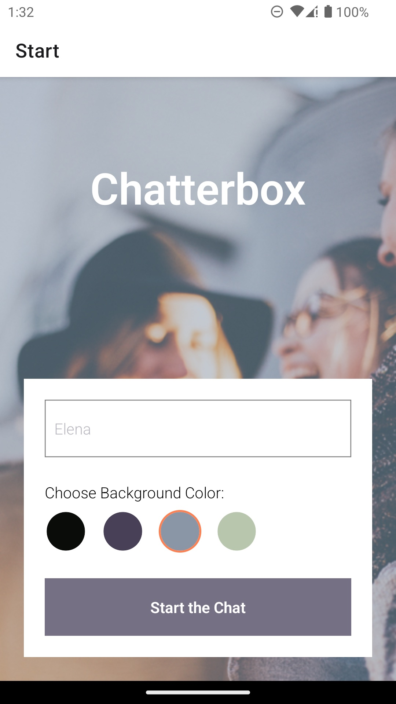

# Chatterbox (Mobile Chat App)

## Table of Contents

- [Overview](#overview)
- [Links](#links)
- [Features](#features)
- [Getting Started](#getting-started)
- [Process](#process)
  - [Main Technologies and Dependencies](#main-technologies-and-dependencies)
  - [Linting and Formatting](#linting-and-formatting)

## Overview

 

This app is built with React Native and Expo, JavaScript frameworks facilitating the development of cross-platform native applications. The implementation includes the utilization of the Google Firestore Cloud database and incorporates the real-time WebSockets protocol for the storage and retrieval of chat messages. Messages are stored locally using the React Native AsyncStorage library.

The app provides users with a chat interface and options to share their images and their location using Expo's ImagePicker and Location APIs.

**Compatibility Note:** Please be aware that the camera function is currently incompatible with devices running Android 13 operating system. However, all other features and functionalities of the app are fully accessible on all supported platforms.

## Links

- [Code URL](https://github.com/ElenaUJ/chatterbox)

## Features

- A start page where users can enter their name and choose a background color for the chat screen before joining the chat.

- A chat page displaying the conversation, as well as an input field and submit button.

- Two additional communication features: sending images and location data.

- Data gets stored online and offline.

## Getting Started

**Prerequisites**

Before running the React Native app on Expo, ensure you have the following prerequisites:

- Node.js (maximum version 16.19.0)
- npm
- Expo and Expo CLI (to install, run `npm install -g expo-cli`)
- Expo Account

**Testing**

To test the app you can use:

- Android Studio and Android SDK (for Android development)
- Expo Go App (to test on your own mobile device)
- Xcode (for iOS development, macOS only)

**Installation**

Run following commands in your terminal:

1. To clone the repository...
   `git clone https://github.com/ElenaUJ/chatterbox.git`

2. To navigate to the project directory...
   `cd chatterbox`

3. To install dependencies...
   `npm install`

**Configuration**

4. Open the folder and create a `config.js` file in the root directory of the project.

5. (Optional) If you don't have a Firebase account yet, [create one](https://firebase.google.com/).

6. [Create a Firebase project](https://firebase.google.com/docs/web/setup#create-project) by following steps 1 through 5.

7. Next, [register your app](https://firebase.google.com/docs/web/setup#register-app) by following steps 1 through 3. Copy the `firebaseConfig` code block provided after `// Your web app's Firebase configuration `.

8. Open the `config.js` file you created earlier. Paste and export the `firebaseConfig` object as follows:

   ```javascript
   // Replace placeholders with your Firebase project configuration
   const firebaseConfig = {
     apiKey: 'YOUR_API_KEY',
     authDomain: 'YOUR_AUTH_DOMAIN',
     projectId: 'YOUR_PROJECT_ID',
     storageBucket: 'YOUR_STORAGE_BUCKET',
     messagingSenderId: 'YOUR_MESSAGING_SENDER_ID',
     appId: 'YOUR_APP_ID',
   };

   export default firebaseConfig;
   ```

   Then save the file.

   _Note: Do not share your config.js file or commit it to version control systems as it contains sensitive information, including your Firebase API key. Keep it secure and accessible only to authorized individuals._

**Running the app**

10. Start the Expo development server by running `npx expo start` in your terminal.

11. Scan the QR code with the Expo Go app on your iOS or Android device, or select an emulator to run the app!

## Process

### Main Technologies and Dependencies

**Technologies:** React Native, Expo, Google Firestore, AsyncStorage, ImagePicker API, Location API

**Dependencies:** For a complete list of dependencies, please refer to the [package.json](./package.json) file.

### Linting and Formatting

- ESLint Rules: [View rules](https://github.com/mydea/simple-pokedex-app/blob/master/.eslintrc)
- Prettier configuration: [View configuration](https://stackoverflow.com/questions/55430906/prettier-single-quote-for-javascript-and-json-double-quote-for-html-sass-and-c)
